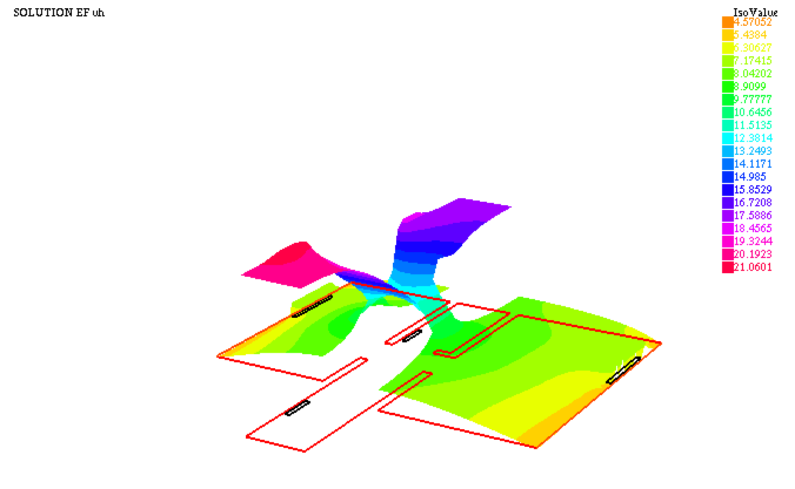
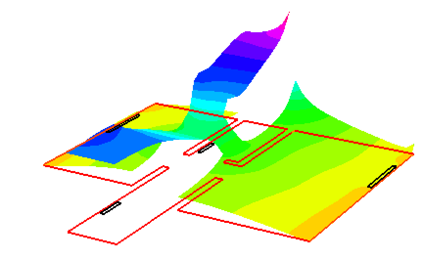

# 🔥 Simulation thermique 2D (FEM)

Projet réalisé en binôme dans le cadre du cours sur La méthode des éléments finis (FEM) à l'Université de Reims. Ce cours est une composante du Master 1 Mathématiques et Apllications parcours Calcul Scientifique.

## 🎯 Objectif

-  Étudier la distribution thermique dans un logement 2D réaliste en résolvant l'équation de la chaleur stationnaire à l'aide de la FEM.

    <a href="https://github.com/kayivi/simulation_thermique/blob/main/figures/plan_maison.png">

      
-  Analyser l’impact des matériaux, des sources de chaleur (radiateurs), et des conditions aux limites sur la température intérieure.

---

## ⚙️ Méthodologie

- Modélisation mathématique de l’équation de la chaleur (2D stationnaire) avec conditions de Dirichlet, Neumann et Fourier-Robin
- Génération d’un plan 2D du logement et maillage géométrique détaillé sous FreeFem++
- Implémentation d’un solveur variationnel pour la température, avec source de chaleur localisée (radiateurs)
- Simulation de cas avec différentes puissances de radiateurs et positions ouvertes/fermées des portes
- Étude comparative de scénarios avec ou sans extraction (VMC) et analyse de leur effet sur la température (cas homogènes et non homogènes)

---

## 📁 Organisation du dépôt
- [`src/`](https://github.com/kayivi/simulation_thermique/tree/main/src) : code source Matlab et FreeFem++ 
- [`results/`](https://github.com/kayivi/simulation_thermique/tree/main/results) : résultats numérique
- [`figures/`](https://github.com/kayivi/simulation_thermique/tree/main/figures) : images clés du projet (Plan, Maillage)
- [`docs/`](https://github.com/kayivi/simulation_thermique/tree/main/docs) : Compte rendu du projet

---

## 📷 Résultats
- Visualisation de la diffusion thermique selon la position des sources et la conductivité des parois
- Analyse de l’influence des matériaux, de la géométrie et des conditions aux limites sur le confort thermique
- Observation d’une meilleure homogénéité thermique avec VMC et portes ouvertes, mais aussi de pertes thermiques plus fortes en périphérie

| Cas homogène | Cas non homogène |
|---------------------------|-------------------|
|  |  |

---

## 🔧 Outils

`GNU Octave` `FreeFem++`  —— EDP, Résolution FEM (FE-P1 : éléments finis P1), Modélisation thermique, Analyse variationnelle
